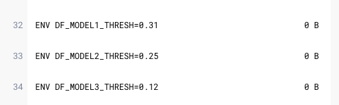
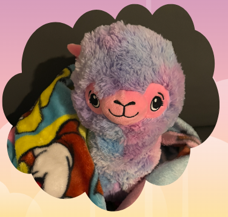
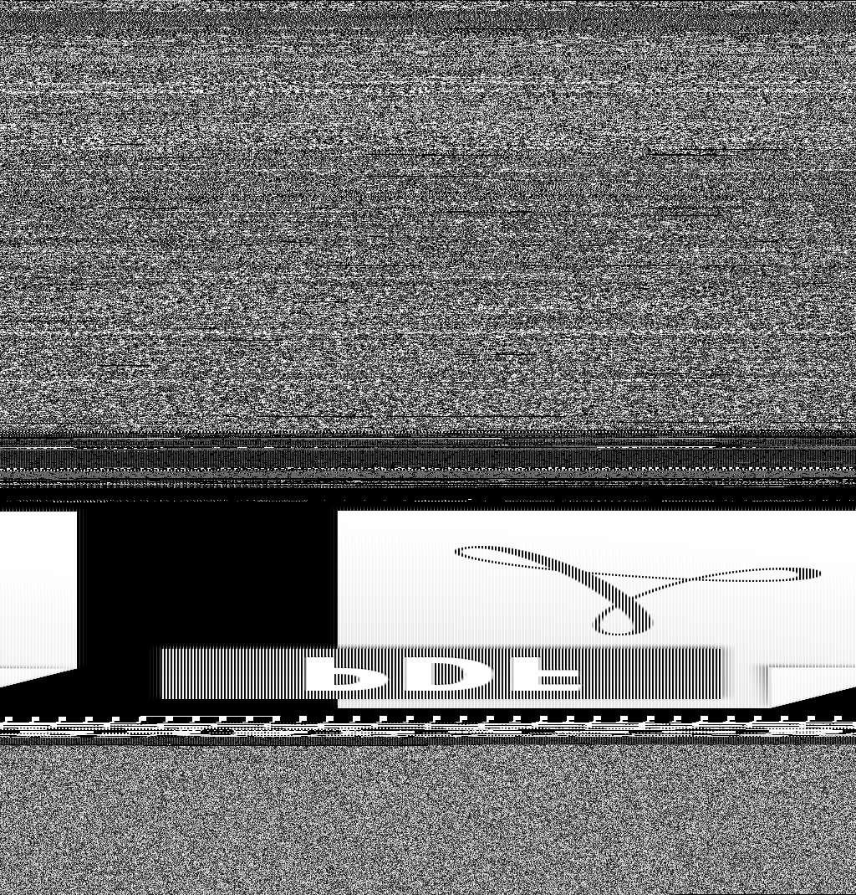
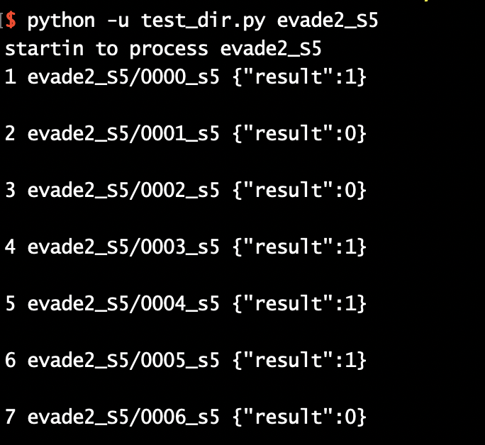
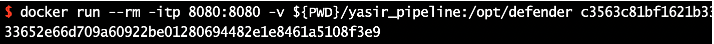
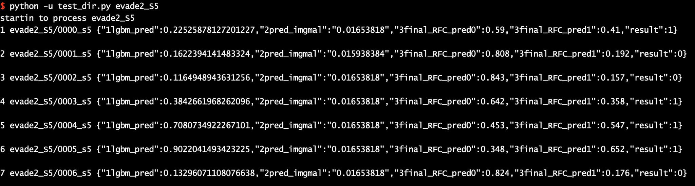
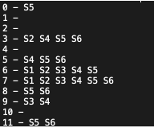

First of all, shoutout to my awesome teammates: [Veronika Maragulova](https://www.linkedin.com/in/vmaragulova), [Soumyajyoti Dutta](https://www.linkedin.com/in/soumyajyoti-dutta-4a4177173) & [Sidharth Anil](https://www.linkedin.com/in/sidharthanil98) (Yes, we share the same name! :D)

# Outline
1. TL;DR
2. Competition Details
3. Our Defense
4. Our Attacks

# TL;DR
- Watch our Final Presentation [here](https://drive.google.com/file/d/1QJeIXBmKkMypbiSLtJ1mJV1OwDrWRkqy/view), shoutout to Jenny for recording our presentation!
- Github Repo [here](https://github.com/sidbav/AV-vs-Evasive)
- Docker Hub Link of our Malware Detection Model [here](https://hub.docker.com/repository/docker/sidbav/689-final-submission/general) (you will need a docker account to access this!)
- Results of the Competition [here](https://docs.google.com/spreadsheets/d/1Phf5sTbCE8c16iRW4brKIYG52AaRb2L2/edit?usp=sharing&ouid=106247587660774829285&rtpof=true&sd=true) (we placed first in Attacks!)

# Competition Details
The purpose of this competition is to build a defensive malware detection systems (static analysis only) specifically for Windows PE files, and in the second stage of the competition to develop adversarial malware samples that are able to evade other teams malware detection systems.

## Defense
Deliverable: Self-contained docker image with model querying via HTTP requests.

Goals:
```
FPR: 1% | TPR: 95%
```

Constraints:
```
 Memory: 1 GB max RAM
 Response time: 5 seconds per sample
 Warning: Timeouts will be considered evasions.
```

## Attack
Deliverable: Evasive Malware Binaries.

Goals:
```
Evade the most models possible.
```

Constraints:
```
Maximum file size: 5MB of appended data.
Evasive sample execution in sandbox must be equivalent to original sample.
```

# Our Defense
## Submitted Defense
We went with a pipeline approach to detect malware, developing two models:
```
Zoe: Random Forest (100 estimators, depth 5, <60%M, >64%G)
                  Trained on EMBER 2018
                           +
Mike: Random Forest (300 estimators, depth 25, <47%M, >=47%G)
          Trained EMBER 2018, BODMAS, Benign-NET

Send to Mike if Zoe threshold in range [60-64%]
EMBER Feature Extractor
```
You can access our docker image [here](https://hub.docker.com/repository/docker/sidbav/689-final-submission/general) (you will need a docker account to access this!)

Why did we go with two RFCs? In alot of the papers that we read, RFCs are widely used for malware detection, much more popular than Neural networks, since they can introduce non linear relationships. In addition, we tried out a lot other moels, but they did not really work


## Failures
Before coming up with our final submission model, we encountered a lot of failures.

### Failed Defense Models
We tried many other models (most of them being tree based models): SVM, SGD, XGBoost, ExtraTrees, CatBoost, VotingClassifier, LCE

Some of the issues we ran into with these models
- Failed to train
- Weird/bad results
- Ran out of time
- [TAMU HPRC](https://hprc.tamu.edu/) would kill our training process for some reason, so we could not leverage their hardware resources

### Failed Defense Strategies
We tried out some other defensive strategies as well, but those also did not work:
- More datasets → hardware limitations, we were building all of our models on our local computers rather than in the cloud leading us with very low performance machines
- Malware search based on vocabulary: we wanted to train our model using malware similar to the malware we were being tested on, but we did not have time to implement a script to search for this malware.
- Professor’s feature extractor: This feature extractor has 200,000 features, and given our limited hardware training was taking way too long to leverage this
- Imbalanced datasets → scared of the Zoo: We found a great dataset called [theZoo](https://github.com/ytisf/theZoo), but we did not want to clone this repo on our computers since it was live malware, and at the time we did not have VMs setup at the time.

## Fun Facts
- You *cannot* `bash` into our docker image (that is intentional on our part), since (at the time) we believed that this would prevent other teams from whitebox attacking our model. There is a way around this that I that I realized afterwards, which we leverage in our attacks (refer Breaking In Section in attacks for more details)
  - This was done by adding the command `RUN /bin/sh -c rm /bin/*` in our Dockerfile after all of the setup is complete

- As another defensive measure we list many environment variables that are simply not utilized to throw teams off if they looked at the details of the docker image. For example, all of the model thresholds are incorrect, in fact three of them are my  teammates' birthdays:

  
  - 31 -> Sid A's Bday
  - 25 -> Veronika's Bday
  - 12 -> Soumya's Bday

- Zoe is our "team mascot":



- Mike is [Mike Wazowski](https://en.wikipedia.org/wiki/Mike_Wazowski) from Monster's Inc

- To submit our defensive model we all pulled an all nighter, which is the first time I pulled an all nighter! 100% would not recommend! I would recommend getting blackout curtains though so you can sleep anytime of the day!

# Our Attacks

## Submitted Attacks
To develop adversarial malware samples we leverage our [Professor's Dropper](https://github.com/marcusbotacin/Dropper) which was built to mimic the calculator on Windows Machines.

Our attacks are:
- Professor’s dropper + ~50 additional functions
- Professor’s encoded dropper + ~50 additional functions
- Professor’s dropper + ~35 additional functions
- Professor’s dropper + ~15 additional functions
- Append Strings

These additional functions were specifically selected from goodware files that were classified with VERY high confidence by the teams' models we were attempting to evade.

## Weaker Attacks
### Packers
We attempted to make use of popular and very sketchy packers such as:
  - [FuckThatPacker](https://github.com/Unknow101/FuckThatPacker)
  - [PEzor](https://github.com/phra/PEzor)
  - [Alienyze](https://alienyze.com/)
  - [MEW](https://www.softpedia.com/get/Programming/Packers-Crypters-Protectors/MEW-SE.shtml)

These packers were able to reduce a lot of model's confidence in classifying malware files, but none were able to flip the label from malware (1) to goodware (0), so we did not use this approach

### Embedding the Malware as an Image
Our motivation for this idea was to make use of [steganography](https://www.kaspersky.com/resource-center/definitions/what-is-steganography) by embedding the malware in an image, but this approach was not feasible since it would increase the filesize by at least 8X.

So we opted to just directly convert the malware sample to an image, save it as a resource in a dropper. Then when the file is executed, the image is read, uncompressed, and then dropped as an exe (or dll). Here is an example of what malware looks like as an image:


Initially when developing this approach we used [OpenCV](https://opencv.org/) to convert image back to a PE file, but the adversarial was not functional since it relied on the OpenCV dll (which is not available on every single windows computer). So then we made use of an opensource library called [lodepng](https://github.com/lvandeve/lodepng) and this [gist](https://gist.github.com/Neboer/f47a7fa2006650e9350a384225f94a4f) which were completely self contained to convert the image back to a PE file.

The reason we did not use this attack is when testing against some of the other teams models this approach ended up performing much much worse than simply adding the original malware file directly as a resource!

Another idea we had the was to embed the malware as the application icon for the dropper, but we simply could not get around to it. Here you cannot use a png file type, you would need to convert the malware PE file to an `.ico` file.

## Breaking In! (WhiteBoxing)
Most teams (including ourselves) only provided the final result of our models, either a 1 indicating malware or 0 indicating goodware classification for the submitted file. However, when developing attacks see more details, such as the soft labels will allow us to see how *well* our attacks are performing (is there a huge decrease in confidence, or is is very small)


Therefore to get more details, I realized if we knew the file path (inside the docker image) where the teams had their code/models saved, I can leverage the `docker cp` command to copy their code/models onto my local machine. This provided me with two benefits:
- I can see their code and models, and understand their defense approach
- I can make code changes to reveal more data such as soft labels to better understand our attacks. To apply these code changes, simply mount the local copy of their code as a [volume](https://docs.docker.com/storage/volumes/) when running their docker image.

For example, before applying local code changes for one team's model, we only see the final results:

However, after mounting my code local code changes, we can see a lot more details of our adversarial malware is classified.



## Finding a Common Strategy
After developing many different attack strategies we wanted to find an approach that worked best across all 6 models we were attacking (including our own). Initially we developed a graph and tried to eyeball which strategy works best for a specific file (for all models) but that was tough to do. So we opted develop a table, where we list out the strategies that can be used to bypass all models for that specific file.



Then we applied the following algorithm to select strategy:
```
For file in samples:
If (strategy == works):
	use(strategy, file)
Else:
	# Append RANDOM strings to strategy that bypasses most models
  HAIL_MARY!(file)
```

Using this approach we were able to fully bypass 4/6 of the teams model (including ourselves)