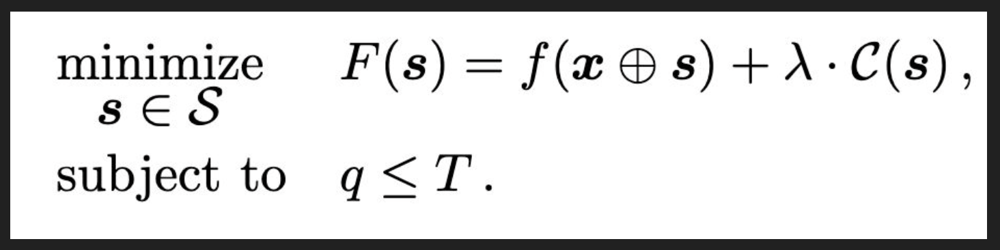

This week we continued continued discussing developing adversarial malware. This paper takes a more "planned" approach to developing malware; in the two papers from last week the approaches were much more "random". The title of this paper is [Functionality-Preserving Black-Box Optimization of Adversarial Windows Malware](https://ieeexplore.ieee.org/document/9437194) by Demetrio et. al.

# Summary
- The authors of this paper are attempting to bypass two different malware detector models - MalConv and a Gradient Boosting Decision Trees (GBDT). Both of these models are byte based models - meaning they do not extract different attributes of the PE file.

- Here the authors do not know the internal structure of the malware detection models; thus they are performing a blackbox attack.

- The approach the authors take to develop the malware samples is using Genetic Algorithms to modify the malware files to attack the models.
  - Using the GA, they will inject benign bytes (not random bytes) into the padding sections of these malware files. This will ensure any changes made to these malware files are functionality preserving.
  - Typically these bytes are added to the DOS Header.

- Since a genetic algorithm is being utilized (an optimization algorithm), the authors defined the objective function in the following manner:

  - The function `f` represents the probability of evasion after injecting the benign bytes into the malware file
  - The `C` function represents the cost of injecting the benign bytes into the malware (larger the injection, greater the cost).
  - The  $\lambda$ parameter can be tuned to consider the tradeoff between payload size cost and probability of evasion
  - The function will be minimized for each malware file.

- Using this objective function, genetic algorithm will be applied. The three steps of genetic algorithms: Selection, Crossover, and Mutation.
  - Selection - Samples from the pool of malware modifications are selected
  - Crossover - From the samples - the random injected bytes are "merged" with the with malware files
  - Mutation - Bytes are randomly changed - Here we cannot ensure our injected bytes are still benign, they may be considered random.

- After applying the Genetic Algorithm approach to develop malware samples, the researchers saw that the GBDT was more suspectable to injection type attacks

- The researchers have found that the models are biased towards Packers (UPX), detecting the vast majority of files as malware if they contain the UPX packer.

- What are some limitations of an injection attack?
  - Models that are not byte based will likely not be evaded with this type of attack
  - Dynamic analysis will be able to easily detect the malware (obviously this is much more expensive to perform for the AV)

# Discussion
- What does it mean to be Query Efficient?
  - In this context it means performing a low number of queries against an AV engine without triggering the AV's Intrusion detection system. The goal is to perform the least number of queries since you do not want to reveal your malware to the AVs, and it reduce's the amount of effort on your end
  - To keep attackers guessing, AV engines can use accuracy equivalent models (either in a pool or select a model at random) so attackers have to perform a greater number of queries to learn about a specific model. Greater number of queries increases the likelihood that an attacker will trigger the Intrusion detection system.

- What does it mean to be functionality persevering?
  - Functionality Persevering in this context means that after making modifications to the original malware file, the file should still be malicious and function as expected
  - We have seen in last weeks papers that some of the attempts to create adversarial malware were able to evade the malware detection but were not functional

- Why append Goodware versus random bytes?
  - If a model is analyzing the actual content of the bytes, more likely to be evaded

- Here we are considering a problem that is often referred to as Pareto optimal in robotics - there are two parameters we want to control - the size of injection and the probability of evasion. Both of these factors are dependent on each other, but increasing one, leads to a decrease in the other. So an attacker will need to consider the tradeoffs between the two - this is where the $\lambda$ parameter comes in.

- Slack Space Insertion: This is the region of a binary file where the OS will assume is empty (usually slack space is inserted due to alignment of bytes) - attacker leverage this area of the files to develop adversarial malware
  - Mostly works for bytes based models (as previously mentioned)

- When performing an attack on a model with hard labels, attacker will need to send multiple queries and use a different seed (or in other words a different source of goodware bytes) for each query to test out their adversarial malware. If a model produce soft labels, then a gradient ascent approach may be applied.

- Would an attacker actual use a GA approach?
  - No probably not since it truly is not practical - you need to perform 10000s of iterations to produce a single adversarial malware file. An attacker likely does not have these resources.
  - However, AV companies may use this approach to develop malware files - and use them to train their model. These malware file should aid the model in becoming resilient to attacks.

- Another way to increase the number of queries need to perform is to provide ranges of confidence (0-10% confident that file X is malware, etc.). This provides the attackers with incomplete information.

- It is easier to perform a greybox attack (trying to replicate the malware detector locally on your machine), than to do a complete blackbox attack - you can learn about the model and important features (or in other words features you are able to exploit).
- WhiteBox is the easiest attack to do, but not practical at all.

- Entry point is a feature used in many malware detection models - usually it is fairly consistent for goodware files, thus is entry point is not the "usual" one models will likely classify a file as malware
  - Attackers can get around this using goto/jump statements in their code.
  - Entry points are important to setup everything needed for a file before it starts it actual execution.